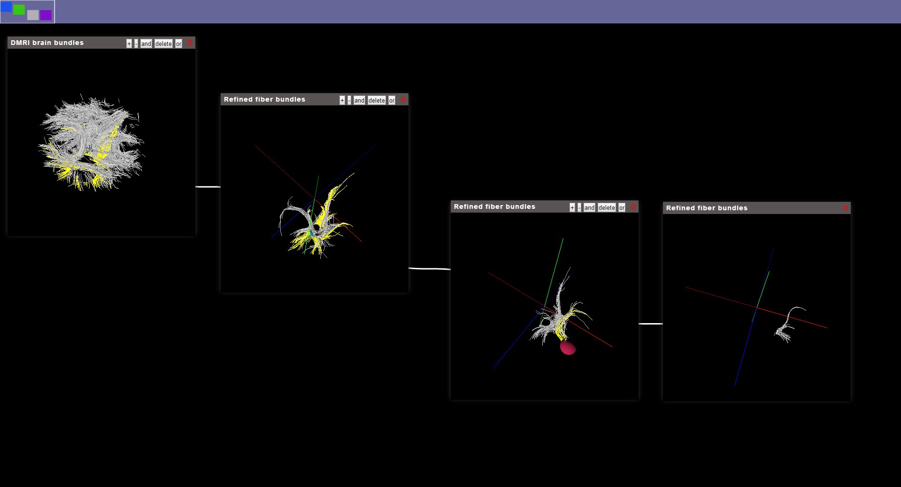

#Composition Visualization
**Screen Shot**:

##Current Introduction
Composition visualization is attempted to create a web-based, convenient and scientific visualization Environment. We try to intergrate some great ideal in visBubble and codeBubble here......

##Project website
**Current Project Files:**[Composition Visualization](http://younyzhu.github.io/Composition_Visualization/visualization.htm)

##Current Operation:

When you open the website, you can click [f] on you keyboard to full screen mode, and with a [Esc] to exit full screen.        
1. On the top is a navigation bar which is to manage the virtual space.    
2. The big UI is the main current view space. You can move in the big square in the navigation bar to adjust the virtual space.    
3. Right click on the space to Open a bubble(menu).    
4. Right click on the space to delete all the bubble(menu).    
5. Right click on the dragging bar[top of a bubble] of a bubble to refine the brain model:   
 
 * After click the refine button, there will come a bar with [+], [-], [add],[delete],[or]    
 * [+],[-] is used to add or delete a selector sphere, you can use  mouse to move the sphere.    
 * When you are moving the sphere, you can also click [up], [down] in your keyboard to adjust the size of you selector sphere.     
 * You could select the fiber with the combination of the bool logical operation: [add],[or].
 * Before select you region of interest, you could also delete the fiber the occlude you, just by click [delete], which will make all the fibers delete when intersecting with the sphere. 
      
6. After you refine a bundle, you can right click in the dragging bar, to export a new bubble with the selected fibers.
7. You could keep selecting in this application.
8. And also with each bubble, there is a parameter bar, you can click [O] on the dragging bar:
	* In the dragging bar, you can adjust the parameter, such as shape, size... for visualizing the model.
      

##Study Event

* before

basic UI design    

* 5/16/2014

ribbons, visualization_backup    

* 5/17/2014~ 5/18/2014

add 2d canvas navigation bar(navigationBar.js), the relation between 2D canvas box component
with the object on the big canvas(main webGL 3D canvas).
finished the box dragging position coordinate

* 5/19/2014

split the visualization.js into bubbleWidget.js and main.js
backup the bubbleWidget(bubbleWidget.js and main.js)
construct a new class: bubbleWidget which contains: the container(canvas),the id, the connectionId    

* 5/20/2014

 1. use the requestAnimFrame to control the 2D canvas draw;   (For the navigation bar, I have consider the svg method or 2D canvas, and finally I pick up 2D canvas)   
 2. finished simple connect line drawing between two widgets;   
 3. And make the operation coordinate.   
 4. modify the link connection, so that we can support the multiply links. (For the link connect, I have consider the svg method or 2D canvas, and finally I pick up 2D canvas)   
 5. Add navigation Bar(Select the current viewpoint) move to control the current  viewpoint object move, this realize the virtual space screen

* 5/21/2014

 1. modify the bugs in navigation bar, and the coordinate with the current view box;   
 2. make the drag, draging and operation on virtual space coordinate.    

* 5/22/2014

 1. collision detection of the bubble widget   
 2. if two widget collision, they should automatic split.
Modify: change from geometry.name to line.name so in Bubble we need to modify   
 3. select the reserve of select data.   
 4. finished keep quary by select.   
(When you change the mode, you should use keyboard to rotate the model (Arrow key or (A,S,D,W)))    
 [I use the line.name to keep the fiber bundle name, and use the line.geometry.name to keep the select fiber bundle]   
 ----This is used for 5 single fiber bundle
5.Start to convert to a single fiber bundle.

* 5/23/2014----5/26/2014

 1. build ray caster to select and drag the sphere multi-shpere selectors
 2. build the intersection between the sphere and the fibers(line)
 3. finished fiber bundle: Logical operation: (AND OR), SELECT DELETE
--Two class: FiberSelector.js (Selector: for every sphere selector, FiberSelector: manage the whole selector and select the select result);
Those are in the sphereSelector.html.

* 5/27/2014

1. Modify the bug in the delete function of multi-selection
//Connect the selector in sphereSelector.html
so change some files here: ObjectLoader.js
I was very angry about me, I spend a day to find another bug: the program goes well when I write in sphereSelector.html,
However, when I moved it to the bubble program,
It cannot move. At spend a day to find the bugs in ray caster, and the difference between the two program.
Today I find the program is in the Mousedown MouseMove event EventListener. It shoud not be the problem!!!
I was so careless!!

* 5/28/2014

 1. Split the file(bubbleWidget.js) -> bubble.js and bubbleWidget.js
 2. In FiberSelector.js, we has a global variable, which is to store the deleted fiber,so that we do not need to calculate the intersection of the deleted fibers.  
**Illustruction:** I use this.SelectResults to store the fibers that are selected by current selectors,
                   and I use this.deletedFibers to store all the fibers that have been deleted from the current model.
 3. ObjectLoader.js: this.selectedFibers, this.deletedFibers. [Model = select_fibers + deleted_fibers + left_fibers]   
When loader a dataset, we need to know which is to select and which is to delete:   
  * if the this.deletedFibers.length === 0, we just need to load the select fibers;
  * if this.selectedFibers.length === 0, we need to loader the model wipes out the deleted fibers;
  * if this.selectedFibers.length !== 0 && this.deletedFibers.length !== 0, we just need to load the selected fiber.         

     
* 5/29/2014     

 1. Reading Dr Xu's paper considering his three lights: direct light, indirect light, ambient light.    
 2. Considering view-dependent ribbons, As Webgl do not has Geometry shader, in order to generate the view-dependent ribbons,
 we should calculate with the camera and adjust the ribbon every frame in cpu, it is time consuming.
 3. Applying the Three.js library's cast shading (in shadowMap.html), we make the light source adjustable and look at the effect.
 Looking at the code and considering its implementation.    

* 5/30/2014    

 1. Reading Dr Xu's paper, and some SSAO, LineAO paper he refers
 2. It seems it is hard to use view-dependent ribbon of his ideal.
 An ideal: for SSAO, we should balance the trade-off between global structure and local detail.

* 6/1/2014

 1. Since the view-dependent ribbon can not implement in three.js, so I changed to ribbon.
 2. First I would applied the Three.js cast shadow here, and then find a way to modified the shadow alogrithm.
    * ShadowMapping: [introduction](http://www.nutty.ca/?page_id=352&link=shadow_map#tabs-4)
    * SSAO: [http://www.nutty.ca/?page_id=352&link=ssao](http://www.nutty.ca/?page_id=352&link=ssao)    

* 6/2/2014
 
 1. read the ShadowMapping Code THREE.js has, and its ShadowMapping Plugin(PCF filter and soft PCF filter).
 2. modify the ShadowMapping Plugin with customShader, and try to apply the VSM, and ESM from
[http://www.nutty.ca/?page_id=352&link=shadow_map#tabs-4](http://www.nutty.ca/?page_id=352&link=shadow_map#tabs-4)
 3. successfully applied the VSM alogrithm.

* 6/3/2014

 1. [Test/ShadowMap.html](https://younyzhu.github.com/Composition_Visualization/Test/ShadowMap.html), you can adjust custombubble.js to adjust shadowType(PCF, PCFSoft, VSM,ESM)
      this.renderer.shadowMapType = THREE.PCFShadowMap;
      this.renderer.shadowMapType = THREE.PCFSoftShadowMap;
      this.renderer.shadowMapType = THREE.VSMShadowMap;   //Try to apply VSMShadowMap
      this.renderer.shadowMapType = THREE.ESMShadowMap;   //Try to apply ESMShadowMap
 2. Use mouse to pick up the light(ball) to deside the light position, press [t] to output the depth map
 3. CastShadow alogrithm encode depth map with phong shading and filter alogrithm    
 4. Looking at the SSAO alogrithm Three.js has and some article he refers, looking at some other ssao alogrithms:
 [http://www.nutty.ca/?page_id=352&link=ssao](http://www.nutty.ca/?page_id=352&link=ssao),
 [http://codeflow.org/entries/2011/oct/25/webgl-screenspace-ambient-occlusion/](http://codeflow.org/entries/2011/oct/25/webgl-screenspace-ambient-occlusion/)
  The latter one looks pretty good.

* 6/4/2014
1. Continue trying to code the SSAO, but I find it is hard to debug the shader, so I think I should modify the shader(SSAO) Three.js has, and then applied with the cast shadow which is done before.
2. So I spend a lot of time to combine the SSAO with the casting shadow. Finally, it seems works.
3. [Test/ssao.html](https://younyzhu.github.com/Composition_Visualization/Test/ssao.html): SSAO + one light(top right) (phong shading with casting shadow) + Directional light(position:0, 0, 1)
4. Parameters need to adjust.

* 6/5/2014
1. intergrate the SSAO + casting shadow to the UI    
2. fix a bug when resizing the window and zoom in and out define a depthPassShader    
3. begin writing another SSAO shader

* 6/6/2014
1. It seems the shader has the problem and can not find it.
2. I spend almost a day to inspect the shader and can not find where is the problem.
3. I output the view-space position, normal, depth, origin color and the result seems right. I caluate the Ao use another method, the problem still exist.
4. Maybe it is not my shader problem, it is just the normal.

* 6/7/2014
1. still stuck in the new ssao shader, do not find where is wrong.
2. try to fix the composition visualization problem and fix.
2. It seems ssao do not work, so I just put it down first.

**Till now incluse files**

      <!--Css style-->
      <link href="css/visualization.css" rel="stylesheet" type="text/css">
      <link href="./jqueryLib/jquery.contextMenu.css" rel="stylesheet" type="text/css" />
      <link href="./jqueryLib/jquery-ui-1.10.4.css" rel="stylesheet" type="text/css" />
      <!--Jquery Lib-->
      
      
      
      
      <!--Three.js lib(modified part R66)-->
       <!-- modified part-->
      <!--Shader:postprocessing_basic-->
      
      
      
      
      <!--Shader-->
      
      
      
      
      <!--Tool-->
      
      
      
      
      <!--Main display-->
      
      
      
      
      
      
      <!--Shape-->
      
      
      
