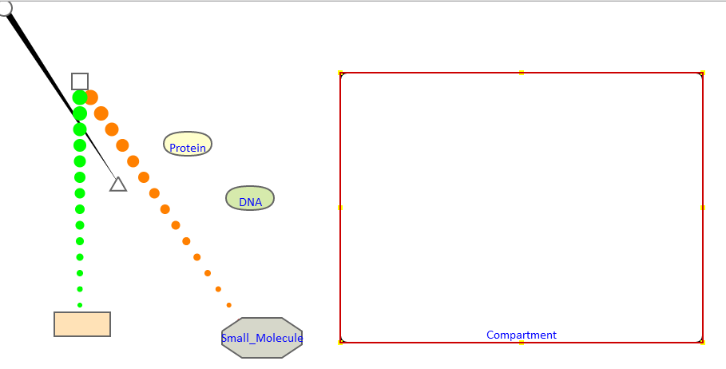

## Path Bubble Layout Design

##Introduction   

  Path bubble Project from  [https://sites.google.com/a/umbc.edu/pathbubbles/home](https://sites.google.com/a/umbc.edu/pathbubbles/home)     
  You can get detailed informaiton from [https://sites.google.com/a/umbc.edu/pathbubbles/pathbubbles-1-0](https://sites.google.com/a/umbc.edu/pathbubbles/pathbubbles-1-0)   
  This part of project is trying to let human adjust the layout of the bubble, and find the best and beautiful layout.   
##Current ProjectWebsite
  Please visit [website](http://younyzhu.github.io/Path_Bubble/pathBubble.html) 
##Operation
  
  1. Click `f` on your keyboard for full screen, Click `ESC` for exiting `Full Screen` mode.    
     
  2. Load File(Graph scene):
     * Click: `Choose File` for searching the file you want to Load. Here, we support the `JSON` and `XML` format   
     * After selecting a file, you can press `Load` to load your file.
  3. Save File(Graph scene)
     * Input: `Worker Id` for user to input the Amazon mechnical turk worker Id, so that we can identify which work belongs whom.   
     * After input your worker Id, you can press `Send`, you `scene` result will be send to our server.
     
##Study Event

-  -  -  -  -  -  -  -      

Some Abbrevations:

`L`:`Set`  

`C`:`Complex` 
  
`P`:`Protein` 
 
`R`:`Reaction`

`S`:`Small-molecule`

`D`:`Dna`

`Physical Entity`:`E`

`M`:`Compartment`

`J`:`Black Arrow`

`A`:`Activation Green arrow`

`I`:`Inhibition(yellow)`

`T`:`Transition`

`A`:`Association`

`K`:`Dissociation`      

-  -  -  -  -  -  -  -

* 7/2/2014      
 1. Today, I begin to write the path bubble program. First, write the basic frame work, try to use html5 2d canvas to draw thing.
 
* 7/3/2014       
 1. Test using the widget to contain all the things, but it seems not very well. so I deside do not use bubble widget.    
 2. First, I will draw the basic shape first and then consider different types of layout and the logic.     
   
     * Finish drawing roundRectangle `Compartment.js`: Which is called `Compartment`, and also this rectangle needs to be draggable and resizeable.    
     * Finish drawing text `Text.js`: which is used for showing the `Compartment` name under the middile bottom of the rectangle.
     * Finish drawing `Protein.js`: which is used to draw the Protein.    
     * Finish drawing `DNA.js`: which is used to draw the DNA.
     * Finish drawing `Small_Molecule`: which is used to draw the small molecule.
     * Finish drawing `Complex.js`: which is used to draw the complex.
     * Finish drawing `Arrow.js`: which is used to draw the arrow.    
     * Finish drawing  `Transition.js`: which is used to draw the transition reaction with the combination of the `Arrow`  
     * Finished drawing `Dissociation.js`: which is used to draw the association reaction with the combination of the `Arrow`
     * Finished drawing `Association.js`: which is used to draw the dissociation reaction with the combination of the `Arrow`
     * Finished drawing `Inhibition.js`: which is used to draw the reaction attributes with the varying radius to show the direction.    
     * Finished drawing `Activation.js`: which is used to draw the reaction attributes with the varying radius to show the direction.    
         
     
 3. Fixed a bug, when select a shape, it will be highlight with red color.   
 4. Try a night to draw a bubble widget, It seems not very well.[http://jsfiddle.net/younyzhU/a25Jt/2/](http://jsfiddle.net/younyzhU/a25Jt/2/) 
 
 * 7/4/2014   
 
 1. Try to write a XML loader to parse the data.
 2. Design the relationship of all the object inside the scene. Here is the **Father---Children** relationship    
     `Father`:Bubble.    
        ====>`Child`: Compartment.    
        ====> ====>`Child`: Protein, Complex, Small Molecule, DNA, ... 
 3. Add cascade relation with the compoments, when you move the extener container, all the thing inside the container will move.
    Here, you can draw bubble, compartment and things in the compartment.
              
 4. Make three types of arrows moveable.     
        
 5. As `Arrows` should be draw on the lowest layer, so I first draw the arrow and then draw the other elements by dividing 
 the drawCompartment function into two parts:  drawCompartment and  drawCompartmentElements     
 6. Information from Keqin `Arrow` is bind with the `Node`, so I need to change the code of the `Arrow.js`, `Activation.js` and `Inhibition.js`. 
      
    
 * 7/5/2014
 
 1. Try add [data.gui.js](http://workshop.chromeexperiments.com/examples/gui/#1--Basic-Usage) to the program for file loader control.
 2. Try to use clipping technique to clip a bubble region [http://jsfiddle.net/younyzhU/xjC9r/1/](http://jsfiddle.net/younyzhU/xjC9r/1/),
    But when I add the the program, when I move the bubble, the region becomes smaller and smaller.    
 3. Fixed a bug: Bubble object do not need to add offsetX;  
 4. Add `Complex` and `Protein` to the scene. load the original `error` dataset.

  * 7/6/2014
  
  1. Add Load local File, when load local file we will clear the canvas, and all the object and then draw the data we want.
  2. We do not need to put the  `Bubble` here, so we need to delete the bubble object(Bubble.js).
  3. Changed the (Bubble.js) to (Visualization.js), which can control all the object in the scene. 
  you can span the view with mouse dragging, and will show you the select region when you select to span.
  4. Trying to add  mouse scroll event 
  5. I googled and tried to find how to send the xml to the sever, and the sever must write in php, jsp... 
  But I do not know those language, so I need time to learn it And write the program.        
 
 
 * 7/7/2014 
 1. Add different types of arrows.
 2. Finally, It seems right.
 
 * 7/8/2014 
 1. Change the size of arrow, the direction of the arrow.
 2. Trying to create a webserver, and finally use [WAMPSERVER](http://www.wampserver.com/en/)   
 3. Write the file save function, so that when we click the `Send data`, we can send the current user's data to the server.
  And keep as `json` file.
 4. Fix a bug for save `json` file [http://stackoverflow.com/questions/24641366/save-json-object-to-string-has-some-unwanted-character/24641435#24641435](http://stackoverflow.com/questions/24641366/save-json-object-to-string-has-some-unwanted-character/24641435#24641435)
 5. Add `json File Loader` so that we can check the loaded result, and also we can save the result from the `server`
 6. I test the save and load, It is right.
 
  * 7/9/2014 
  1. Change the dots to become much denser and smaller.
  2. Change the code, when resizing the corner of the compartment.
  3. Multiple selection for the objects
  
  * 7/10/2014 
  1. Multiple selection has a bug, try to spend a night to fix it, but failed, Luckily, fixed this mornin.
  2. Calculate the number of crossing edges
  3. When multi-selecting, we should not select the compartment.    

  * 7/11/2014  
  1. write a d3 format json file for d3's force direct to generate the inial layout.
  2. As the School server would add `\` to the data, when we load the json file we should remove the `\` character, `tempdata = tempdata.replace(/\\/g, "");`.
  
  * 7/12/2014
  1. write the d3 direct force layout.
  2. Spend a night to find the output problem. Finally find the problem is the relative position coordinate.
  
  * 7/13/2014
  1. write a file log event to save the activity of the users
  2. tring to apply the force direct alogrithm 
  
  * 7/14/2014 
  1. Processing the data with the mechnical turk task intruction design [http://younyzhu.github.io/mturk/index.html](http://younyzhu.github.io/mturk/index.html)    
  2. Reading some force direct alogrithm, and fix some bugs
  
  * 7/15/2014
  1. As convert to d3 to process the data takes too much time, so I deside to implement the force direct alogrithm in my bubble program.
  2. I just generate the initial position from force direct alogithm.
  3. Pick the alogrithm from [Springy](http://getspringy.com/), thanks to `Dennis Hotson`, I changed part of the code to adjust our dataset.
  4. Simple view modified some code of the [Springy](http://getspringy.com/), With a demo of my dataset. [Demo](http://younyzhu.github.io/Path_Bubble/Test/demo.html)
  
  * 7/16/2014
  1. Finished intergrate the force direct alogrithm to my pathbubble program
  2. Some bugs fixed, and some fonts adjusted.
  3. Write a `xml, json loader` for pre-processing through force directed algorithm, And when we press the `Stop Force layout` button in the menu bar, 
  the system will stop the automatic layout calculation. When you mouse click any where on the screen, the final layout would be generated. 
  You can go further study for reducing the edge crossing, node crossing or some other task.
  4. Write a xml output format for KeQin
  