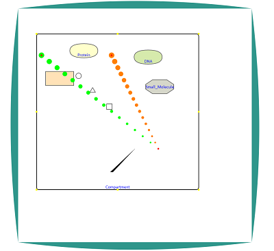

## Path Bubble Layout Design

##Introduction   

  Path bubble Project from  [https://sites.google.com/a/umbc.edu/pathbubbles/home](https://sites.google.com/a/umbc.edu/pathbubbles/home)     
  You can get detailed informaiton from [https://sites.google.com/a/umbc.edu/pathbubbles/pathbubbles-1-0](https://sites.google.com/a/umbc.edu/pathbubbles/pathbubbles-1-0)   
  This part of project is trying to let human adjust the layout of the bubble, and find the best and beautiful layout.   
##Current ProjectWebsite
  Please visit [website](http://younyzhu.github.io/Path_Bubble/pathBubble.html) 

##Operation
  
  1. Click `f` on your keyboard for full screen, Click `ESC` for exiting `Full Screen` mode.    
  2. Right Click open a bubble.
  
##Study Event

* 7/2/2014      
 1. Today, I begin to write the path bubble program. First, write the basic frame work, try to use html5 2d canvas to draw thing.
 
* 7/3/2014       
 1. Test using the widget to contain all the things, but it seems not very well. so I deside do not use bubble widget.    
 2. First, I will draw the basic shape first and then consider different types of layout and the logic.     
   
     * Finish drawing roundRectangle `Compartment.js`: Which is called `Compartment`, and also this rectangle needs to be draggable and resizeable.    
     * Finish drawing text `Text.js`: which is used for showing the `Compartment` name under the middile bottom of the rectangle.
     * Finish drawing `Protein.js`: which is used to draw the Protein.    
     * Finish drawing `DNA.js`: which is used to draw the DNA.
     * Finish drawing `Small_Molecule`: which is used to draw the small molecule.
     * Finish drawing `Complex.js`: which is used to draw the complex.
     * Finish drawing `Arrow.js`: which is used to draw the arrow.    
     * Finish drawing  `Transition.js`: which is used to draw the transition reaction with the combination of the `Arrow`  
     * Finished drawing `Dissociation.js`: which is used to draw the association reaction with the combination of the `Arrow`
     * Finished drawing `Association.js`: which is used to draw the dissociation reaction with the combination of the `Arrow`
     * Finished drawing `Inhibition.js`: which is used to draw the reaction attributes with the varying radius to show the direction.    
     * Finished drawing `Activation.js`: which is used to draw the reaction attributes with the varying radius to show the direction.    
         
     
 3. Fixed a bug, when select a shape, it will be highlight with red color.   
 4. Try a night to draw a bubble widget, It seems not very well.[http://jsfiddle.net/younyzhU/a25Jt/2/](http://jsfiddle.net/younyzhU/a25Jt/2/) 
 
 * 7/4/2014   
 
 1. Try to write a XML loader to parse the data.
 2. Design the relationship of all the object inside the scene. Here is the **Father---Children** relationship    
     `Father`:Bubble.    
        ====>`Child`: Compartment.    
        ====> ====>`Child`: Protein, Complex, Small Molecule, DNA, ... 
 3. Add cascade relation with the compoments, when you move the extener container, all the thing inside the container will move.
    Here, you can draw bubble, compartment and things in the compartment.
              
 4. Make three types of arrows moveable.     
        
 5. As `Arrows` should be draw on the lowest layer, so I first draw the arrow and then draw the other elements by dividing 
 the drawCompartment function into two parts:  drawCompartment and  drawCompartmentElements     
 6. Information from Keqin `Arrow` is bind with the `Node`, so I need to change the code of the `Arrow.js`, `Activation.js` and `Inhibition.js`. 
      
    
 * 7/5/2014
 
 1. Try add [data.gui.js](http://workshop.chromeexperiments.com/examples/gui/#1--Basic-Usage) to the program for file loader control.
 2. Try to use clipping technique to clip a bubble region
 
    
    
    
 
 